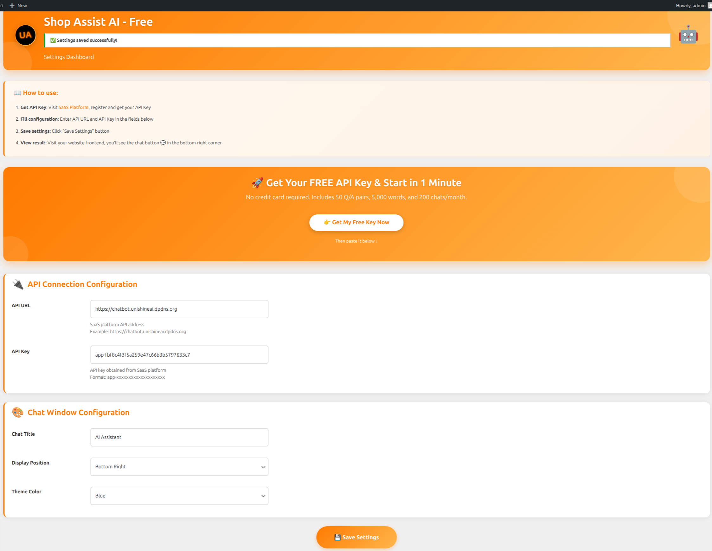
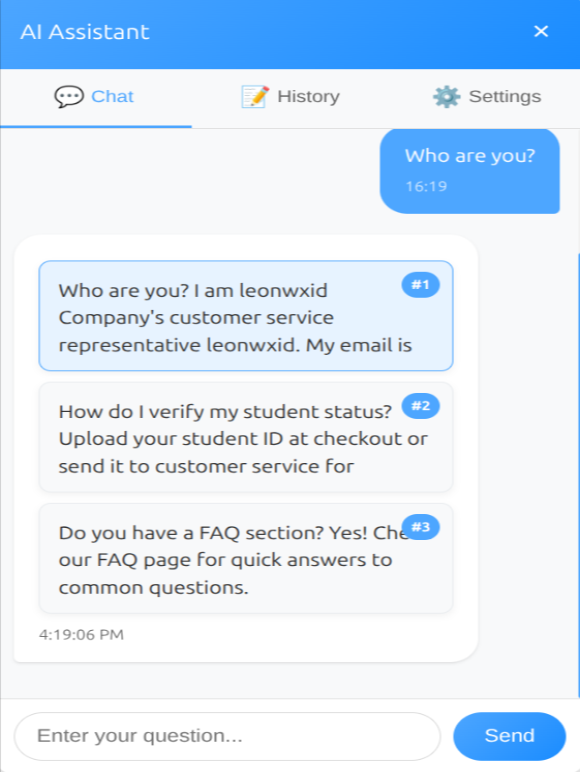

# Shop Assist AI / Shop Assist AI

Add an intelligent AI chatbot to your WordPress site in 1 minute. No coding. Get your free API key and start answering questions automatically.

在1分钟内为您的WordPress网站添加智能AI聊天机器人。无需编码。获取您的免费API密钥，立即开始自动回答问题。

## 🎬 Demo Video / 演示视频

> ⏱️ Watch how to set up your AI chatbot in just 5 minutes!
> ⏱️ 观看如何在5分钟内设置您的AI聊天机器人！

## 📸 Screenshots / 截图

### Admin Settings / 管理设置

Simple and clean settings page - just paste your API key and you're ready to go!

简单干净的管理页面 - 只需粘贴您的API密钥，就可以开始使用了！

### Chat Widget / 聊天小部件

Beautiful, customizable chat widget that matches your brand.

美观、可定制的聊天小部件，与您的品牌完美匹配。

### Usage Statistics / 使用统计

Real-time usage statistics dashboard - track your Q/A pairs, words, and chats.

实时使用统计仪表板 - 跟踪您的问答对、字数和对话次数。

## ✨ Features / 功能特性

### 🚀 1-Minute Setup / 1分钟设置
- Install the plugin
- Get your free API key from our SaaS platform
- Paste the API key
- Start chatting immediately!

- 安装插件
- 从我们的SaaS平台获取免费API密钥
- 粘贴API密钥
- 立即开始聊天！

### 💰 Truly Free Tier / 真正免费
- **50 Q/A pairs** in knowledge base
- **5,000 words** total capacity
- **200 chats/month** included
- No credit card required

- 知识库中**50个问答对**
- 总容量**5,000字**
- 每月**200次对话**
- 无需信用卡

### 🎨 Fully Customizable / 完全可定制
- **5 beautiful themes**: Blue, Green, Red, Purple, Dark
- **4 display positions**: Bottom-right, Bottom-left, Top-right, Top-left
- **Custom chat title**
- **Brand matching colors**

- **5种美观主题**：蓝色、绿色、红色、紫色、深色
- **4个显示位置**：右下、左下、右上、左上
- 自定义聊天标题
- 品牌匹配颜色

### 📚 Knowledge Base Integration / 知识库集成
- Pre-built templates for different industries
- Upload your own documents
- Automatic Q&A generation
- Real-time knowledge base updates

- 不同行业的预构建模板
- 上传您自己的文档
- 自动问答生成
- 实时知识库更新

### 💬 Chat Features / 聊天功能
- **Tab navigation**: Chat, History, Settings
- **Chat history export** to TXT file
- **Typing animation** for natural conversation
- **Knowledge base cards** with multiple answers
- **Sound notifications**

- **选项卡导航**：聊天、历史、设置
- **聊天历史导出**为TXT文件
- **打字动画**实现自然对话
- **知识库卡片**显示多个答案
- **声音通知**

## 📝 Blog Posts / 博客文章

### English / 英文版
- [How to Build a Zero-Config AI Chatbot for WordPress](https://chatbot.unishineai.dpdns.org/blog-post1/)
- [Boost Your E-commerce Sales with AI-Powered Support](https://chatbot.unishineai.dpdns.org/blog-post2/)

### Chinese / 中文版
- [5分钟部署AI聊天机器人 - 零配置](https://chatbot.unishineai.dpdns.org/blog-post1-zh/)
- [用AI驱动的支持提升电商转化率](https://chatbot.unishineai.dpdns.org/blog-post2-zh/)

## 🎯 Perfect For / 适合人群

- Small business websites
- WooCommerce stores
- Portfolio and service sites
- Blogs and content publishers
- Anyone who wants instant customer support

- 小型企业网站
- WooCommerce商店
- 作品集和服务网站
- 博客和内容发布者
- 任何需要即时客户支持的人

## 📥 Installation / 安装

### Method 1: Install from WordPress.org / 方法1：从WordPress.org安装

1. Log in to your WordPress admin
2. Go to **Plugins → Add New**
3. Search for "Shop Assist AI"
4. Click **Install Now**
5. Activate the plugin
6. Go to **Settings → Shop Assist AI**
7. Click the link to get your **FREE API Key**
8. Paste the API Key and URL into the settings page and save
9. The chat button will appear on your site! 💬

1. 登录WordPress管理后台
2. 进入 **插件 → 安装插件**
3. 搜索"Shop Assist AI"
4. 点击 **现在安装**
5. 激活插件
6. 进入 **设置 → Shop Assist AI**
7. 点击链接获取您的**免费API密钥**
8. 将API密钥和URL粘贴到设置页面并保存
9. 聊天按钮将出现在您的网站上！💬

### Method 2: Manual Upload / 方法2：手动上传

1. Download the plugin ZIP file
2. Go to **Plugins → Add New → Upload Plugin**
3. Choose the ZIP file and click **Install Now**
4. Activate the plugin
5. Follow steps 6-9 above

1. 下载插件ZIP文件
2. 进入 **插件 → 安装插件 → 上传插件**
3. 选择ZIP文件并点击 **现在安装**
4. 激活插件
5. 按照上面的步骤6-9操作

## ⚙️ Configuration / 配置

### Get Your Free API Key / 获取免费API密钥

1. Visit [SaaS Platform](https://chatbot.unishineai.dpdns.org/login)
2. Register for a free account
3. Get your API key from the dashboard
4. Paste it in the plugin settings

1. 访问 [SaaS平台](https://chatbot.unishineai.dpdns.org/login)
2. 注册免费账户
3. 从仪表板获取您的API密钥
4. 将其粘贴到插件设置中

### Customize Your Chat Widget / 自定义聊天小部件

- **Chat Title**: Change the assistant's name
- **Display Position**: Choose where the chat button appears
- **Theme Color**: Match your brand colors
- **Sound Notifications**: Enable/disable sound alerts

- **聊天标题**：更改助手的名称
- **显示位置**：选择聊天按钮出现的位置
- **主题颜色**：匹配您的品牌颜色
- **声音通知**：启用/禁用声音警报

## 📊 Usage Statistics / 使用统计

The plugin displays real-time usage statistics:

- **Q/A Pairs**: Number of knowledge base entries
- **Total Words**: Total word count in your knowledge base
- **Chats**: Number of conversations this month

When you reach the free tier limits, you'll see an upgrade prompt.

插件显示实时使用统计：

- **问答对**：知识库条目数量
- **总字数**：知识库中的总字数
- **对话**：本月对话次数

当您达到免费版限制时，您会看到升级提示。

## 🔄 Upgrade to Pro / 升级到专业版

Need more capacity? Upgrade to Pro for:

- **500 Q/A pairs** (10× Free)
- **50,000 words** total (10× Free)
- **5,000 chats/month** (25× Free)
- **Priority support**
- **Advanced analytics**
- **API access**

Only **$29/month** with a 14-day free trial!

需要更多容量？升级到专业版即可获得：

- **500个问答对**（免费版的10倍）
- **50,000字**总计（免费版的10倍）
- **每月5,000次对话**（免费版的25倍）
- 优先支持
- 高级分析
- API访问

仅需**$29/月**，提供14天免费试用！

## ❓ Frequently Asked Questions / 常见问题

### Is there really a free plan? / 真的有免费计划吗？

Yes! Sign up on our platform for a free account that includes 50 Q/A pairs, 5,000 total words, and 200 chats per month. No credit card required.

是的！在我们的平台上注册免费账户，即可获得50个问答对、5,000总字数和每月200次对话。无需信用卡。

### How do I get more features? / 如何获得更多功能？

Inside the plugin settings, you'll see your usage. When you need more, click the "Upgrade to Pro" button to get 10x more capacity and advanced features for $29/month.

在插件设置中，您会看到使用情况。当您需要更多时，点击"升级到专业版"按钮，即可获得10倍的容量和高级功能，价格为$29/月。

### Can I customize the look? / 可以自定义外观吗？

Absolutely. You can change the chat button position (bottom-right, bottom-left, etc.), theme color, and the assistant's name.

当然可以。您可以更改聊天按钮位置（右下、左下等）、主题颜色和助手名称。

### Do I need technical skills? / 需要技术技能吗？

No technical skills required. If you can install a WordPress plugin, you can use Shop Assist AI.

无需技术技能。如果您能安装WordPress插件，就可以使用 Shop Assist AI。

### Is my data secure? / 我的数据安全吗？

Yes! Your data is encrypted and stored securely. We also offer self-hosted deployment options for complete data control.

是的！您的数据经过加密并安全存储。我们还提供自托管部署选项，以实现完全的数据控制。

## 🌐 Live Demo / 在线演示

Try the live demo: [https://chatbot.unishineai.dpdns.org](https://chatbot.unishineai.dpdns.org)

尝试在线演示：[https://chatbot.unishineai.dpdns.org](https://chatbot.unishineai.dpdns.org)

## 📞 Support / 支持

- **Website**: [https://chatbot.unishineai.dpdns.org](https://chatbot.unishineai.dpdns.org)
- **Email**: support@unishineai.dpdns.org
- **Documentation**: [https://github.com/unishineai/shop-assist-ai-free/wiki](https://github.com/unishineai/shop-assist-ai-free/wiki)

- **网站**：[https://chatbot.unishineai.dpdns.org](https://chatbot.unishineai.dpdns.org)
- **邮箱**：support@unishineai.dpdns.org
- **文档**：[https://github.com/unishineai/shop-assist-ai-free/wiki](https://github.com/unishineai/shop-assist-ai-free/wiki)

## 🤝 Contributing / 贡献

We welcome contributions! Please feel free to submit a Pull Request.

我们欢迎贡献！请随时提交Pull Request。

## 📝 License / 许可证

GPL v2 or later

[License File](LICENSE)

GPL v2 或更高版本

[许可证文件](LICENSE)

## ⭐ Star us on GitHub! / 在GitHub上给我们星标！

If you like this plugin, please give it a star on [GitHub](https://github.com/unishineai/shop-assist-ai-free)!

如果您喜欢这个插件，请在 [GitHub](https://github.com/unishineai/shop-assist-ai-free) 上给我们一个星标！

---

**Made with ❤️ by [UniShine AI](https://chatbot.unishineai.dpdns.org)**

**由 [UniShine AI](https://chatbot.unishineai.dpdns.org) 用 ❤️ 制作**